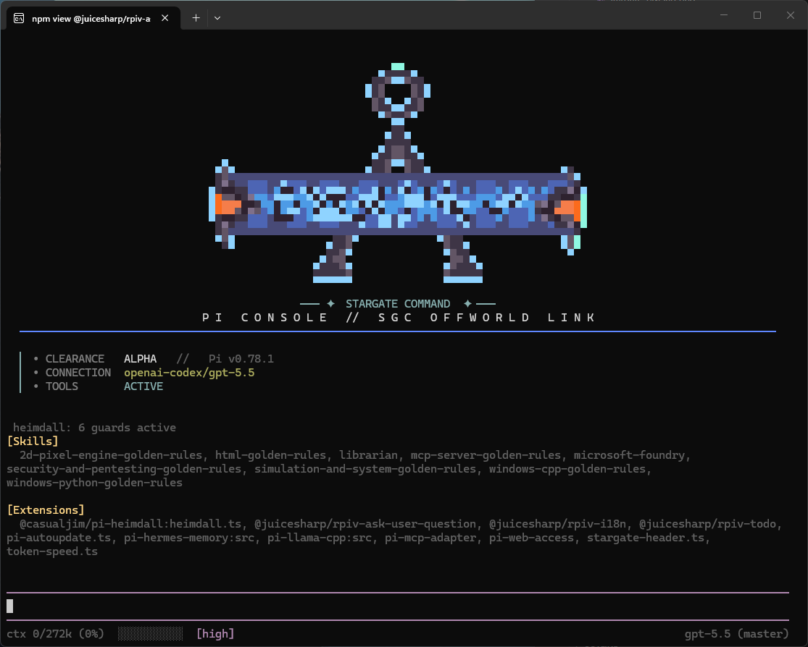

# Pi configuration (`~/.pi`)

Personal configuration for the [Pi coding agent](https://pi.dev): a custom
theme, seven local TypeScript extensions, lazily routed procedural skills, and a
few installed pi packages.



## Layout

```text
~/.pi/
├── README.md                  # this file
├── PLAN.md                    # current complex-task state
├── agent/
│   ├── settings.json          # global settings (provider, model, packages, theme)
│   ├── pix.json               # pix extension state/config
│   ├── heimdall.example.json  # portable example; real heimdall.json is OS-local
│   ├── agents/                # custom roles; model routing lives in settings.json
│   ├── prompts/plan.md        # lazy /plan workflow template
│   ├── skills/                # global reusable Pi skills
│   ├── projects-memory/
│   │   └── <project>/skills/  # project-scoped reusable Pi skills
│   ├── npm/
│   │   ├── package.json       # installed pi package manifest
│   │   └── package-lock.json  # installed pi package lockfile
│   ├── package.json           # editor-only devDependencies (see "Editor setup")
│   ├── tsconfig.json          # editor-only TS config (see "Editor setup")
│   ├── extensions/            # auto-discovered local extensions (*.ts)
│   │   ├── alarm-sound.ts
│   │   ├── autotuner.ts       # AutoTuner model gateway (provider + /autotuner)
│   │   ├── pi-autoupdate.ts
│   │   ├── post-edit-validation.ts
│   │   ├── skill-governor/    # metadata router and deterministic audit
│   │   ├── stargate-header.ts
│   │   └── token-speed.ts
│   ├── skill-governor/config.json
│   └── themes/stargate-sg1.json
```

Extensions placed in `~/.pi/agent/extensions/*.ts` are auto-discovered for all
projects and can be hot-reloaded with `/reload`.

## Local extensions

### `pi-autoupdate.ts`

Wraps Pi's own update mechanism so updates can be triggered from inside a
session (by you or by the model).

It delegates to the `pi` CLI rather than calling `npm` directly, because Pi
packages are not global npm installs — they live under `~/.pi/agent/npm/`,
`.pi/npm/`, and `~/.pi/agent/git/…` and are managed by `pi update`.

Command:

- `/update` — update Pi and all packages
- `/update self` — update Pi only
- `/update extensions` — update packages only
- `/update check` — report whether a Pi (self) update is available

Tool (`pi_update`, callable by the model):

- `scope`: `"all"` (default), `"self"`, or `"extensions"`
- `check`: only check the Pi version, don't install
- `confirm`: deprecated compatibility field; ignored (authority is derived from the direct request)
- `force`: reinstall Pi even if current (only with `scope: "self"`)

A direct natural-language request such as “Pi und die Extensions aktualisieren”
authorizes exactly that scope for one model-tool call without a second popup.
“Nur Pi” and “nur die Extensions” cannot silently escalate to the other scope;
forced reinstall additionally requires explicit wording. Quoted examples,
meta-questions, conditional requests, and negations grant no authority. An
unrequested model update is blocked automatically—even if the model requests a
confirmation popup. Typing a valid `/update ...` command is itself explicit
authority; typos show usage instead of defaulting to a full update.

Version-pinned npm specs and pinned git refs are skipped automatically by
`pi update`, so the extension does not special-case them.

On Windows, package updates pause pi-intercom's detached broker and hold its
respawn lock while npm replaces packages. Cancellation propagates through
network checks and child processes; the broker working-directory patch is
re-applied before the lock is released, including after partial failures or
user cancellation. It also preserves a Windows compatibility patch for
`pi-subagents`: async workflows use an independent UUID for their runtime
directory because Pi 0.84 tool-call IDs may contain the Windows-invalid `|`
character. The tracked `agent/npm/patches/postinstall.cjs` applies this fix
while Pi installs package dependencies, before the package is first loaded;
the update extension re-checks it only during an explicitly requested later
update. Since v2.6, the check also recognizes pi-subagents' native conditional
UUID assignment, so current safe releases no longer emit a false compatibility
warning. Merely starting Pi performs no package-source or OS-config mutation.

#### Upstream-publish-bug resilience

Occasionally a package is published to npm with an unresolved `workspace:*`
dependency (a pnpm/yarn monorepo protocol that plain npm cannot resolve). When
that happens, `pi update`'s internal `npm install …@latest` fails with
`EUNSUPPORTEDPROTOCOL`, which aborts the **entire** package update — so one
broken upstream release blocks every other package too.

Before running `pi update`, the extension pre-flights the latest version of
each declared npm package against the public registry. Any package whose latest
version still carries a `workspace:` dependency is treated as "do not update":
the extension updates the remaining packages individually (`pi update
npm:<pkg>`) and skips the broken one, keeping its currently-installed (good)
version. This is self-healing — once the author publishes a fixed version the
pre-flight finds nothing broken and the normal bulk update resumes. The
pre-flight is fail-open (offline / custom-registry / errors never block
updates). It was added after `@xynogen/pix-optimizer@1.1.14` shipped
`"@xynogen/pix-data": "workspace:*"`.

### `alarm-sound.ts`

Plays the configured MP3 when Pi finishes, `ask_user_question` waits for input,
or any extension opens a yes/no confirmation. Permission selectors such as
MCP/RTK allow-or-deny dialogs are detected as well; ordinary menus do not ring.
The wrapper is shared across extensions and deduplicates an already-running
alarm. Use `/alarm-sounds on|off|test|status` to control, test, or diagnose it.

### `autotuner.ts`

Switches local models through [AutoTuner](https://github.com/DaWasteh/Auto-Tuner)
instead of talking to `llama-server` directly. AutoTuner's opt-in control API
(**⋯ → Settings → External control API**, loopback port 1233 by default) owns the
serialized stop/configure/start/health-check transition and keeps every saved
per-model launch setting; the extension only asks for a model ID.

- **Provider `autotuner` in `/model`.** The extension registers the provider
  with the models AutoTuner scanned (`GET /v1/models`), so every runnable GGUF
  appears under provider **AutoTuner** in Pi's native selector. Opening `/model`
  refreshes the catalogue through Pi's `refreshModels` hook; Pi's offline
  startup refresh returns the known list without touching the network.
- **Pre-switch with a status line.** Selecting an AutoTuner model in `/model`
  sends `POST /api/v1/switch` immediately and shows a `⏳ AutoTuner lädt …` status until
  llama-server answers `/health`, then notifies how long the load took. The
  `before_provider_request` hook repeats that idempotent switch whenever the
  request's model differs from the last confirmed one, so a restored session or
  a `/model provider/id` argument never hangs silently for minutes. Restored
  sessions are not pre-warmed on their own; the first request loads the model.
- **`/autotuner`.** Without arguments it opens an interactive switcher built
  from `GET /api/v1/models`, marking the active model (●), runnable ones (○), and
  non-runnable entries (✗) with AutoTuner's reason. `status`, `models`,
  `switch <id>`, `stop`, `refresh`, `health`, and `help` are the subcommands; a
  successful switch also activates the model in Pi.
- **Credentials.** Environment (`AUTOTUNER_API_URL` + `AUTOTUNER_API_KEY`, or
  `AUTOTUNER_CONTROL_API_PORT`/`AUTOTUNER_CONTROL_API_KEY`) wins, then the
  `control_api.json` sidecar AutoTuner ≥ 5.3.9 writes next to its settings,
  then a regex scan of `autotuner_settings.json`. That file holds benchmark
  results and is tens of megabytes here, so it is never JSON-parsed; AutoTuner's
  reference extension refused files above 2 MiB and could not find the token on
  this machine at all. A persisted "disabled" flag is respected unless explicit
  environment credentials override it.
- **Reasoning.** Pi-level `reasoning` mirrors AutoTuner's scanner verdict so
  `reasoning_content` renders as thinking blocks; no `reasoning_effort` or
  budget fields are sent because AutoTuner's saved reasoning launch setting
  stays authoritative. Chat traffic goes through AutoTuner's OpenAI proxy on
  port 1233; llama-server itself keeps listening on 1234.

When the API is off or AutoTuner is closed, the provider registers empty and
stays quiet; `/autotuner status` and a startup warning (only while an AutoTuner
model is the active model) explain what to enable. `AUTOTUNER_DATA_DIR` moves the
settings and sidecar lookup for portable installs.

### `stargate-header.ts`

Replaces the startup header with an open Stargate Command console banner
(chevron crown, rounded gate ring with an event-horizon beam, A-frame stand).
Width-adaptive and re-rendered live on theme, model, skill, and extension
changes.

Commands:

- `/header` — toggle between full and quiet mode
- `/refresh-header` — re-scan skills and extensions

### `token-speed.ts`

Custom footer showing context usage with a progress bar, measured generation
speed (tokens/second), the active thinking level, and estimated thinking and
output token counts, with the model and git branch right-aligned.

### `post-edit-validation.ts`

Uses Pi 0.84.4's native `tool_result` event to collect successful `write` and
`edit` paths, then validates the final batch at `turn_end` after parallel tools
settle. Checks are deterministic and check-only: JSON parsing, skill audit,
TypeScript `--noEmit` through the trusted agent compiler when a config exists,
Node syntax, and optional Python/PowerShell/shell parsing. It never executes an
edited test/module, package install, formatter-write, generic full suite, or
network operation.

All in-process checks run; grouped TypeScript checks take priority within an
eight-command external-validator ceiling. Any overflow is an explicit failure
listing unvalidated files, never silent success. Success is silent. A failure is
persisted and delivered to the next model turn as bounded structured negative
feedback. At most two automatic repair-feedback rounds are sent per user turn;
further failures stop the loop and remain visible as status/evidence.

Since v2.8 the validator is honest about its own limits: a validator killed by
its 30-second timeout is a failure, not a pass, and a non-zero exit with no
output at all (Pi's `exec` never throws for a missing executable) is treated as
an unavailable runtime and skipped. External validators run three at a time
instead of serially. JSON-with-comments files (`tsconfig*.json`,
`jsconfig.json`, `.vscode/*.json`, `*.jsonc`) are not parsed strictly.
TypeScript diagnostics list the edited files first and label diagnostics from
other files as possibly pre-existing, capped at eight lines, so the repair loop
cannot be hijacked by unrelated project errors. Only a real `SKILL.md` triggers
the skill audit, `.sh` files use Git Bash explicitly on Windows, and the
feedback message truncates per validator so its round-limit instruction and
closing tag always survive.

### `skill-governor/`

A lean metadata router, not an authority or sandbox. It ranks every current-scope
skill—including manual skills—without loading bodies. Cloud prompts receive at
most three matching descriptions; interactive local models receive one to keep
the system-prompt string under the measured budget. A selected manual skill is
made normally readable; reading instructions grants no additional authority.

The small `capability_route` tool searches hidden skill metadata and, only in an
interactive local profile, tools that this Governor itself removed. It never
enables a tool that was already inactive or blocked. Returned descriptions are
bounded to 320 characters. Interactive llama.cpp/AutoTuner/Ollama/LM
Studio/vLLM/SGLang sessions initially expose only configured core tools plus
`capability_route`; cloud and headless sessions keep their configured tools and
Pi's full prompt. `/skill-governor` provides read-only status, search, and file
audit. There is no automatic LLM evolution, candidate store, active-skill read
blockade, shell parser, or confirmation UI, and the Governor never asks the
user anything: it only reduces what a local model sees and routes lazily.

v2.8 tightened the lexical router after a review reproduced false routings with
the real 85-skill catalogue: a bare substring of a skill name no longer scores
("ok" inside "smoke", "ui" inside "comfyui"), two-character tokens cannot route
a skill on their own, and generic verbs such as "fix", "repair", or "mach
weiter" are stop words. Local detection recognizes the `autotuner` provider and
anchors loopback origins (`127.0.0.1`, `localhost`, `0.0.0.0`, `[::1]`, `[::]`)
so `http://localhost.example.com` is not local. `config.json` is validated
field by field, `maxSkillsLocal` fills the byte budget with as many compact
descriptors as fit, and the governor-owned tool delta is persisted as a session
entry so `/reload` no longer loses the ability to restore hidden tools on the
next cloud switch. The 900-byte bound covers the Governor's own output; package
extensions that run later (Hermes memory policy, pix-optimizer modes) append
their fragments afterwards and own that cost.

With installed Pi 0.84.4 and the current `.pi` scope, the native automatic-skill
prompt measured 7,924 characters (about 1,981 via coarse `chars / 4`). Ordinary
local sessions now replace that boilerplate with a read-first prompt and one
compact, untruncated metadata record only when the complete UTF-8 string remains
at most 900 bytes. This leaves framing margin while conservatively staying below
1,000 tokens for the target byte-based tokenizers; skill bodies remain lazy. An explicit CLI
`customPrompt`/`appendSystemPrompt` has higher precedence and is never truncated;
tool schemas and chat framing are separate provider input. The old v2.4 model
benchmark was not rerun or relabeled as v2.7 evidence.

## Complex work and session branches

Invoke `/plan [objective]` for work with at least three dependent steps or a
likely compaction/session boundary. The lazy prompt creates or resumes root
`PLAN.md`, keeps exactly one step active, and records verified decisions,
checks, and blockers. Small tasks skip the file.

Use Pi's native `/tree` to explore an alternative from the last sound decision;
update `PLAN.md` and inspect `git status` first because conversation branches do
not restore shared files. `/fork` or `/clone` creates a separate session, not a
filesystem worktree. Concurrent writers therefore require isolated worktrees;
otherwise keep one writer.

## Installed packages

Declared in `settings.json` (and/or user settings). See each package upstream
for details:

- `pi-llama-cpp` — local llama.cpp provider/model integration
- `pi-mcp-adapter`, `pi-web-access` — MCP and web tools
- `pi-hermes-memory` — durable memory policy/store
- `pi-subagents`, `pi-intercom` — child-agent and peer-session coordination
- `@juicesharp/rpiv-{todo,i18n,ask-user-question}` — task/UI helpers
- `@casualjim/pi-heimdall` — platform sandbox integration
- `@gaodes/pi-graphify`, `@xynogen/pix-optimizer` — graph and prompt/context helpers
- `pi-prompt-template-model` — prompt-template model selection

The current installed package manifest is also tracked in
`agent/npm/package.json` / `agent/npm/package-lock.json` so the repository
reflects the package set managed by `pi update`.

## Heimdall sandbox and OS-local state

`agent/heimdall.json` is intentionally **not** tracked. Heimdall's sandbox uses
Linux `bubblewrap`, so the bundled `pi-autoupdate.ts` extension keeps the real
local config aligned with the current OS:

- Linux: `sandbox.enabled = true`
- Windows: `sandbox.enabled = false`
- macOS: `sandbox.enabled = false` until Heimdall supports a macOS sandbox

This prevents Windows/Linux/macOS checkouts from constantly dirtying Git with an
OS-specific config flip. `agent/heimdall.example.json` documents the portable
shape of the config.

Other local runtime files are ignored too, including generated Heimdall defaults,
`agent/models-store.json`, mission indexes, run history, intercom/session state,
SQLite lock databases (including WAL/SHM sidecars), Hermes memory databases, and
project `MEMORY.md` files. Credential files, private keys, certificates, tokens,
and environment files are excluded defensively as well.

## Published skills

Reusable Pi skills are intentionally tracked because they can help other users
even on different systems:

- `agent/skills/**/SKILL.md` — global skills
- `agent/projects-memory/*/skills/**/SKILL.md` — project-scoped skills

Only the skill files are published; private memory files and session databases
remain ignored.

A project skill is only ever routed when its `projects-memory/<key>` folder
equals the basename of the git top level (or the working directory) of the
session. v2.8 audited all 85 skills against that rule and the machine's real
paths: 20 skills lived under keys that could never match (the retired
`DaWasteh ComfyUI Nodes` clone, `Goa'uld Translator`, `llama-mcp-server`,
`PyTank`, `GitHub`) and were moved to `DaWastehs-ComfyUI-Bundle`,
`Goauld Translator`, `llama-mcp`, `Python-Games-Collection`, or the global
skills. Five completed one-off migrations and tool-less skills were retired to
the ignored `agent/skill-governor/retired/` folder. Stale roots (`H:/ComfyUI`,
`C:\LAB`, the `DaWasteh - Neu` workflow folder) were corrected, and the
identical 500-byte governance paragraph plus the two boilerplate description
tails ("Manual-only: invoke only for…", "Do not use for unrelated project
work…") were shortened in 61 files. The tails were 30 % of all description
bytes, produced measurable routing noise for everyday words, and pushed six
skills over the local 900-byte budget. Skill bodies are still lazy and
untouched otherwise; merging the overlapping live-avatar and YuE skills remains
a manual editorial task.

## Theme

`stargate-sg1` — an amber/orange SGC terminal palette. Selected via
`"theme": "stargate-sg1"` in `settings.json`. The theme file references a
remote `$schema`; VS Code may warn that the schema URL is "untrusted" and skip
download. That is cosmetic and does not affect Pi, which validates themes
itself.

## Settings

Key fields in `agent/settings.json`:

- `defaultProvider` / `defaultModel` — the provider and model used on startup
- `packages` — installed pi packages
- `theme` — active theme name
- `compaction` — context compaction thresholds
- `thinkingBudgets` / `defaultThinkingLevel` — reasoning token budgets per level
- `subagents` — central role-to-model routing and local fallback policy

Compaction reserves 32,768 tokens and keeps the most recent 32,768. The former
131,072-token keep window exceeded Pi's 128,000-token llama fallback threshold
once the reserve was subtracted, so it could not reliably free context. Durable
task state belongs in `PLAN.md`, not an oversized recent-message tail. Thinking
budgets use Pi's documented 1,024 / 4,096 / 10,240 / 32,768 progression instead
of the former 2,048 / 8,192 / 32,768 / 65,536 allocation.

### Local model profile

The router recognizes local provider IDs/loopback URLs rather than hard-coding
unavailable model aliases. Public checkpoint/API names verified for this release
are `Qwen/Qwen3.8-27B`, `Qwen/Qwen3.8-Flash-Next`,
`google/gemma-4-31B-it`, and Mistral's `mistral-medium-3-5`; llama.cpp model IDs
remain whatever `/v1/models` actually exposes. Qwen aliases currently present in
`modelThinkingLevels` use medium reasoning. Other aliases are not invented while
the local server is offline.

All local families share the same short tool discipline: schema-valid arguments,
real tool results as ground truth, and correction of validator errors before a
success claim. No source reviewed for v2.7 established a reliable
family-specific prompt advantage, so separate Gemma/Mistral/Qwen prose profiles
would add unsupported complexity.

Local models are normally selected through the `autotuner` provider (see
`autotuner.ts`); `llamaServerUrl` stays on port 1234 because that is where
AutoTuner starts llama-server, so the direct `llama-server` provider remains a
manual fallback.

### Global engineering guideline: Ponytail

`pix.json` now starts every session with pix-optimizer's **Ponytail** mode at
level `full` (the "lazy senior developer" ruleset adapted from
DietrichGebert/ponytail): stdlib and native features first, no speculative
abstractions, the shortest diff that works, deliberate shortcuts marked with a
`ponytail:` comment, and explicit safety floors that must never be simplified
away (validation at trust boundaries, error handling that prevents data loss,
security, accessibility, one runnable check for non-trivial logic). The runtime
toggle `/optimizer ponytail <level>` still persists overrides to
`optimizer.json`.

This matches the research the extensions are built on. The empirical study of
skill-induced failures found that most cost regressions come from excessive
procedure (mandatory verification checklists, heavy pipelines) and always-loaded
skill text rather than from irrelevant skills; the misevolution and WikiSkill
work show that persistent procedures need short, inspectable bodies with
explicit safety floors. Ponytail encodes exactly that trade-off for the code
the agent writes, and it lets the agent default instead of asking when a
question is not genuinely needed. For interactive local sessions the Governor's
compact prompt already carries the "smallest complete safe change" rule; the
full Ponytail fragment is appended by pix-optimizer after it, which is the one
deliberate exception to the local byte budget.

### Subagent model hierarchy

The parent orchestrator starts on GPT-5.6 Sol Max. Child roles use the cheapest
appropriate tier without per-run model overrides:

| Tier | Intended work | Roles |
| --- | --- | --- |
| GPT-5.3 Codex Spark Low (128k) | Mechanical repo scans, targeted reproductions, tiny obvious fixes | `scout`, `context-builder`, `delegate`, `bugtester`, `mechanic` |
| GPT-5.6 Luna Low | Lightweight non-mechanical evidence synthesis | `web-searcher` |
| GPT-5.6 Terra Low | Substantial implementation and research | `worker`, `researcher` |
| GPT-5.6 Sol High | Leadership, planning, critical review, architecture judgment | `teamleiter`, `advisor`, `oracle`, `planner`, `reviewer` |

Spark is also the subagent default, so unclassified roles do not silently inherit
the expensive parent model. Local llama-server fallbacks are intentionally omitted
while the provider/`local` alias is absent from Pi's active model registry:
pi-subagents validates every fallback before launch, so a configured offline alias
would block even a healthy cloud primary. Add the exact registered
`llama-server=http://127.0.0.1:1234/local` candidate only while `/v1/models`
actually exposes it. Tasks that may exceed Spark's 128k window or require
non-mechanical judgment must be escalated upward.

## Editor setup

Out of the box, opening this folder in VS Code shows errors such as
`Cannot find module '@earendil-works/pi-coding-agent'`, `Cannot find name
'process'`, and several "implicitly has an 'any' type" warnings.

These are editor-only. Pi loads extensions through
[jiti](https://github.com/unjs/jiti), which resolves TypeScript and the pi
packages at runtime with its own bundled copies — the extensions run fine
regardless of what the editor reports.

To give the TypeScript language server the types it needs, install the
editor-only dependencies once:

```bash
cd ~/.pi/agent
npm install
```

On Windows:

```bat
cd %USERPROFILE%\.pi\agent
npm install
```

This installs `@types/node` (fixes `process` and `node:*`), the pi packages
(`@earendil-works/pi-coding-agent`, `@earendil-works/pi-tui`,
`@earendil-works/pi-ai`), the modern `typebox` package, and TypeScript. The
`tsconfig.json` ties it together. Once types resolve, the implicit-any errors
disappear too, because the callback parameter types are inferred from the pi
API.

For a clean checkout, also restore the tracked Pi runtime manifest; its
postinstall hook applies required package compatibility patches before loading.
The legacy-peer flag matches Pi's managed installer and avoids installing stale
host-provided `@earendil-works/pi-*` peers into the extension directory:

```bash
npm --prefix npm install --legacy-peer-deps
```

Validate both the local extensions and runtime dependency set with:

```bash
npm run typecheck
npm test
npm run skill:lint
npm audit --omit=dev
npm --prefix npm audit --omit=dev
```

These are `devDependencies` and are not used by Pi at runtime. If you prefer not
to add a local `node_modules`, the errors are safe to ignore.

## Updating

Update everything (Pi and packages) from a shell:

```bash
pi update --all
```

Or from inside a session with the bundled command:

```text
/update
```
